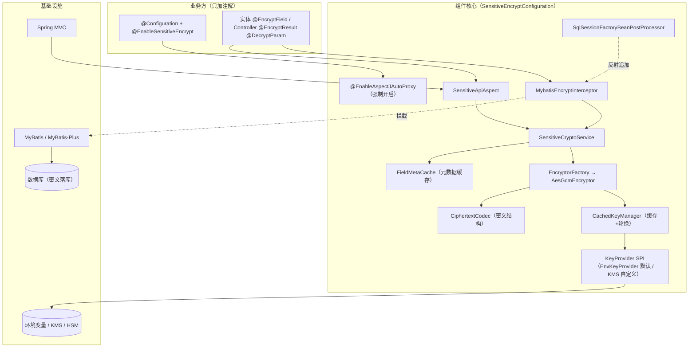
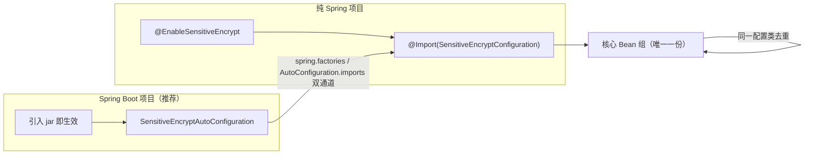
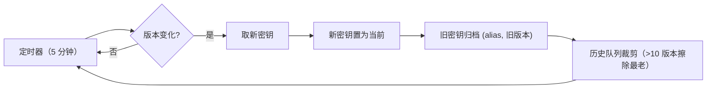
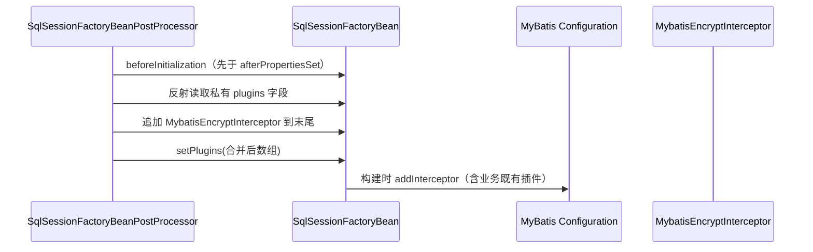
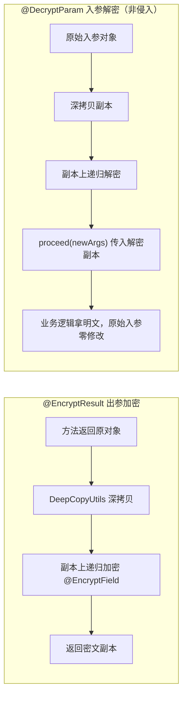
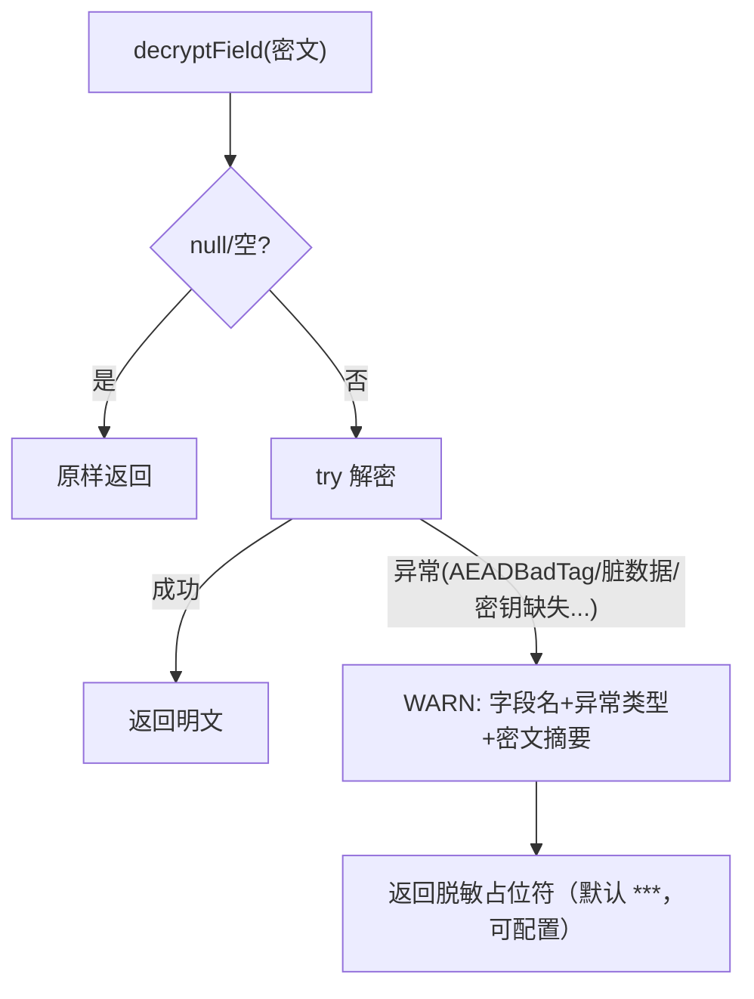
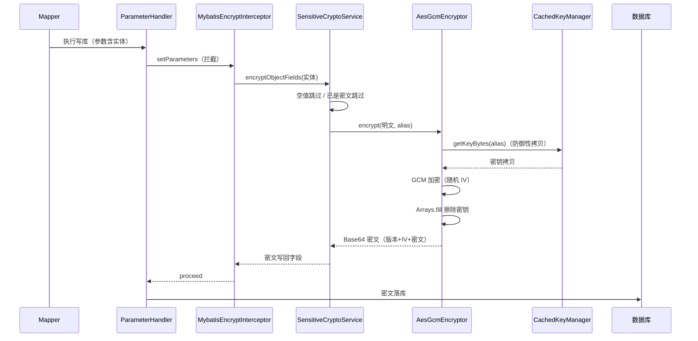
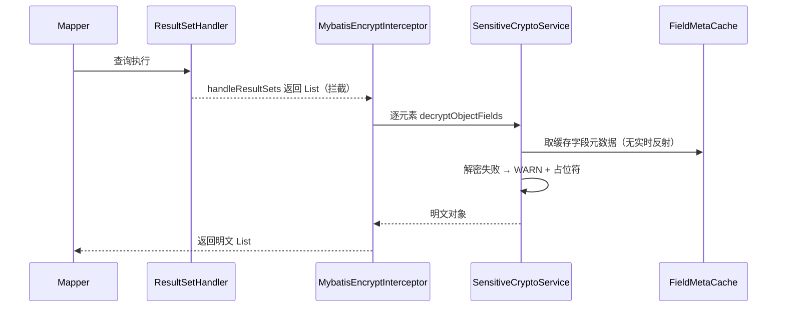
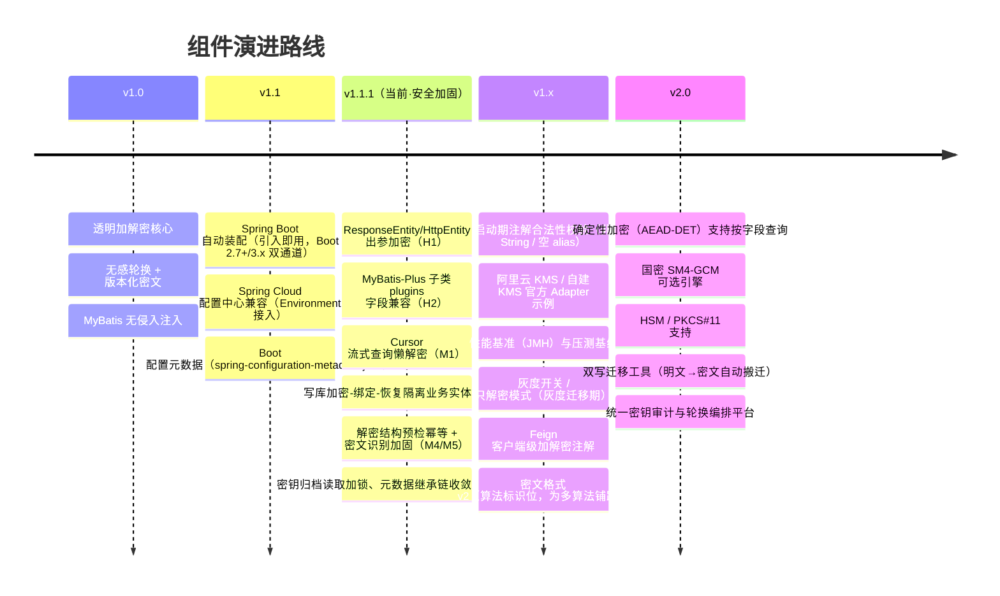

# 敏感数据透明加解密组件 · 设计蓝图

> **文档版本**：1.1.1　**状态**：已实现（代码基线 v1.1.1，含安全加固）　**适用范围**：Spring / Spring Boot / Spring Cloud 企业应用
>
> 本文档是组件的唯一权威设计说明：回答 **为什么这样设计**、**关键安全决策** 与 **演进路线**。
> 代码细节以源码为准；快速开始见 README，业务方实操见 USAGE（使用说明）。
>
> **文档体系**（三者定位互补）：
>
> | 文档 | 定位 | 读者 |
> | --- | --- | --- |
> | [README.md](./README.md) | 快速开始 / 概览 | 集成方（10 分钟上手） |
> | [USAGE.md](./USAGE.md) | **使用说明**：三端接入、密钥配置、注解、轮换、迁移、排障、自查清单 | 业务方 / 运维 / 安全评审 |
> | [BLUEPRINT.md](./BLUEPRINT.md) | 设计蓝图：架构、安全决策、流程、路线图 | 维护者 / 架构师 / 安全评审 |


---

## 1. 文档目的

本蓝图面向组件维护者、安全评审人员与集成方架构师，说明：

1. 组件解决的业务问题与设计边界（目标 / 非目标）；
2. 四条**安全红线**的落地方式与审计点；
3. 分层架构、模块职责与关键运行时流程；
4. 密钥管理（轮换 / 内存安全）、异常降级等核心机制的决策依据；
5. 扩展点、测试策略、合规映射与演进路线图；
6. 与 USAGE.md（使用说明）的分工：蓝图回答「为什么」，使用说明回答「怎么做」。


---

## 2. 背景与目标

### 2.1 背景

企业业务（如 CRM / 电商 / 金融）存在大量敏感字段：手机号、身份证号、银行卡号、地址等。
传统做法是业务代码手动加解密，带来三类问题：

- **漏加密**：开发遗漏导致明文落库，数据泄露时无法追责；
- **侵入性**：加解密逻辑散落在 Service / DAO，无法统一治理与轮换；
- **合规缺口**：等保三级（GB/T 22239-2019）、GDPR 要求数据加密存储与密钥管理，审计难以通过。

### 2.2 目标

- **透明**：业务方只加一个注解 + 实体字段注解，落库 / 查询 / API 传输自动加解密；
- **零侵入 MyBatis**：不要求业务方手动配置拦截器，自动注入（兼容 MyBatis-Plus）；
- **密钥安全**：密钥零硬编码，SPI 化（环境变量 → KMS / HSM），支持无感轮换；
- **高可用**：解密失败降级不中断业务，脏数据可容错；
- **合规**：满足等保三级 / GDPR 的加密存储与密钥管理要求。

### 2.3 非目标（明确不做）

| 项 | 说明 | 理由 |
| --- | --- | --- |
| 按加密字段直接 SQL 查询 | `WHERE phone = ?` 传明文无法命中密文 | 需要确定性加密（AEAD-DET）或加密索引，属 v2 演进，见 §12 |
| 传输层加密（TLS）替代 | 组件解决**存储/应用层**机密性，TLS 负责传输 | 职责分离 |
| 静态脱敏 / 动态脱敏平台 | 那是独立的数据安全组件 | 组件聚焦加解密 |
| 非 String 字段加密 | `@EncryptField` 仅支持 String | 类型系统复杂化收益低 |

---

## 3. 安全红线（强制性约束，评审必查）

组件所有代码必须遵守以下四条红线，违反任意一条视为**严重事故**：

| # | 红线 | 落地方式 | 审计点 |
| --- | --- | --- | --- |
| R1 | **密钥零硬编码** | 密钥经 `KeyProvider` SPI 获取（环境变量 / KMS / HSM）；默认 `EnvKeyProvider` 读 `SENSITIVE_KEY_{ALIAS}` | 主代码 grep 无密钥字面量；配置文件禁止出现密钥 |
| R2 | **算法强制标准** | 仅 `AES/GCM/NoPadding`（AEAD）；IV 每次随机 12 字节并与密文拼接存储；禁止 ECB/CBC/DES/3DES | `Cipher.getInstance` 全代码唯一来源为常量 `AES/GCM/NoPadding` |
| R3 | **内存安全** | 密钥以 `byte[]` 接收，`Cipher` 初始化并完成加解密后立即 `Arrays.fill` 擦除；缓存仅保留主拷贝，刷新/裁剪/销毁时擦除 | `AesGcmEncryptor` finally 擦除；`CachedKeyManager` prune/destroy 擦除 |
| R4 | **日志脱敏** | 日志只允许字段名、长度、脱敏摘要（`SensitiveLogUtils`），禁止明文 / 密钥 / 完整密文 | 全量 log 调用点审查 |

> **设计基调**：**fail-closed（安全默认拒绝）**——加密路径服务缺失宁可写库失败，也不允许明文落库；
> **fail-fast（配置错误快速失败）**——KeyProvider 缺失、拦截器注入失败直接启动报错。

---

## 4. 总体架构

### 4.1 分层架构



### 4.2 模块职责矩阵

| 包 / 类 | 职责 | 关键安全 / 性能点 |
| --- | --- | --- |
| `annotation` | 4 个注解：开启 / 字段 / 出参 / 入参 | `@EnableSensitiveEncrypt` → `@Import` 核心配置 |
| `config.SensitiveEncryptConfiguration` | Bean 装配；强制 AOP；KeyProvider 解析 | 默认 EnvKeyProvider **不注册为 Bean**，避免纯 Spring 下的类型歧义 |
| `boot.SensitiveEncryptAutoConfiguration` | **Spring Boot 自动装配入口**（引入即用，无需注解） | 双通道注册（spring.factories + AutoConfiguration.imports）；`@ConditionalOnMissingBean` 回退；配置类去重 |
| `META-INF/spring-configuration-metadata.json` | Boot 配置项 IDE 元数据 | 仅声明非密钥类配置项，密钥类配置**永不入 metadata** |
| `key.KeyProvider` | 密钥 SPI（`getKeyBytes` / `getCurrentKeyVersion`） | 契约：必须返回新数组，调用方负责擦除 |
| `key.VersionedKeyProvider` | 按版本取历史密钥（轮换解密） | 可选接口，未实现时历史密钥缺失走降级 |
| `key.EnvKeyProvider` | 环境变量 / 系统属性读取，Base64 解码 | 别名规范化（`-`→`_`）；系统属性仅为 CI/测试回退 |
| `key.CachedKeyManager` | 当前密钥 + 历史密钥缓存；5 分钟定时刷新轮换 | 对外只交付防御性拷贝；prune/destroy 擦除主拷贝 |
| `crypto.CiphertextCodec` | 密文打包 / 解包 / 防重加密识别 | 版本长度字段校验防越界；结构即契约 |
| `crypto.AesGcmEncryptor` | 唯一加解密实现 | GCM 128bit Tag；IV 每次随机；finally 擦除全部临时数组 |
| `crypto.EncryptorFactory` | 统一创建 Encryptor | 禁止业务绕过工厂直接 new Cipher |
| `metadata.FieldMetaCache` | `Class → ClassMetadata` 缓存 | 禁止热路径实时反射；子类覆盖同名属性处理 |
| `service.SensitiveCryptoService` | 字段级 / 扁平对象 / 对象树加解密；降级 | 空值快速返回；防重复加密；解密 catch-all 降级 |
| `mybatis.MybatisEncryptInterceptor` | 拦截 ParameterHandler / ResultSetHandler | 批量 List 解密；加密路径 fail-closed |
| `mybatis.SqlSessionFactoryBeanPostProcessor` | 反射追加拦截器到 plugins 末尾 | 保留业务既有插件；幂等；注入失败 fail-fast |
| `aspect.SensitiveApiAspect` | @EncryptResult 深拷贝加密 / @DecryptParam 解密 | 深拷贝隔离，原始对象不被污染；桥接方法处理 |
| `util.DeepCopyUtils` | 对象图深拷贝 | 循环引用保护；无参构造器→序列化→WARN 回退 |
| `util.SensitiveLogUtils` | 日志脱敏工具 | mask / cipherSummary / describe |

### 4.3 Spring Boot / Spring Cloud 接入设计

组件以**单一 jar** 同时服务 Spring / Spring Boot / Spring Cloud，核心代码零 Boot 依赖：



| 机制 | 说明 |
| --- | --- |
| **双通道注册** | `META-INF/spring.factories`（Boot 2.x）+ `META-INF/spring/...AutoConfiguration.imports`（Boot 3.x） |
| **配置类去重** | Spring 的 ConfigurationClassParser 对同一配置类只处理一次，`@EnableSensitiveEncrypt` 与自动装配并存不产生重复 Bean |
| **条件回退** | 自动装配带 `@ConditionalOnMissingBean(CachedKeyManager.class)`，业务显式启用或自定义 Bean 时自动让位 |
| **类加载隔离** | 自动装配类仅被 Boot 的 AutoConfigurationImportSelector 加载；纯 Spring 项目（无 spring-boot）永不触达，天然安全 |
| **无 jakarta 依赖** | 生命周期用 Spring 接口（InitializingBean/DisposableBean），Spring 5.3 / Spring 6（Boot 3.x）均可运行 |

**Spring Cloud 要点**：

| 场景 | 行为 |
| --- | --- |
| 配置中心（Nacos / Apollo / Config Server） | 非密钥配置项经 `Environment` 自动读取，`sensitive.encrypt.decrypt-fail-placeholder` 可动态下发（无需 @RefreshScope，组件按需读取） |
| 密钥托管 | 密钥仍走 `KeyProvider`（环境变量 / KMS / HSM），**禁止入配置中心**（R1 红线） |
| 多实例轮换 | 各实例独立轮询版本；密文内嵌版本 + 按版本取钥 ⇒ 轮换窗口内新旧实例互不影响，无读写中断；建议「先发新密钥、确认就绪、再切版本」灰度 |
| Feign / 网关 | 组件作用于服务边界（Controller/DB）；跨服务传输机密性由 TLS 承担；如需 Feign 客户端级加密，可扩展 `@EncryptResult` 风格注解（v1.x 待办） |

---

## 5. 核心设计细节

### 5.1 密文结构（数据契约，不可随意变更）

```
Base64( [1B:版本长度 N] + [N B:版本字符串 UTF-8] + [12 B:随机 IV] + [密文 + 16 B GCM Tag] )
```

- **版本内嵌**是密钥轮换无感的基础：解密时按密文中的版本号取对应密钥；
- **IV 每次随机**（SecureRandom）：同一明文多次加密产生不同密文，防频率分析；
- **GCM Tag 128bit**：同时提供机密性与完整性，篡改即抛 `AEADBadTagException`；
- **结构校验**：`CiphertextCodec.unpack` 校验长度字段（1~255）与整体长度，防畸形输入；
- **防重复加密**：`looksLikeCiphertext` 通过 Base64 + 结构校验识别已有密文，避免"先查后改"场景双重加密。

### 5.2 密钥管理设计

#### 5.2.1 SPI 契约

```java
public interface KeyProvider {
    byte[] getKeyBytes(String keyAlias);          // 当前版本密钥（调用方负责擦除）
    String getCurrentKeyVersion(String keyAlias); // 当前版本号，如 "v1"
}
```

**契约要求**：返回**新分配的数组**（禁止共享内部状态，否则调用方擦除会误伤数据）；密钥长度必须是 AES 支持的 16/24/32 字节。

#### 5.2.2 缓存与无感轮换



- `currentKeys`（当前主拷贝）+ `archivedKeys`（历史主拷贝，按 `alias+版本` 索引）；
- 同一别名加载 / 刷新串行化（每别名锁），避免并发轮换竞态；
- 轮换后**新写数据用新版本**，**历史数据按内嵌版本号取归档密钥**解密；
- 归档密钥缺失时，若提供者实现 `VersionedKeyProvider` 则补拉，否则解密降级（§5.6）。

#### 5.2.3 内存安全模型

> 严格意义上"密钥不驻留堆"与"缓存密钥以支持轮换"存在矛盾。组件采用折中模型：

| 拷贝类型 | 生命周期 | 擦除时机 |
| --- | --- | --- |
| 主拷贝（current / archived） | 缓存期（轮换必需） | 裁剪出缓存 / 上下文销毁时 |
| 临时拷贝（每次加解密） | 单次操作 | `Cipher` init 并完成加解密后 finally 立即 `Arrays.fill` |
| 敏感中间数组（IV/密文/明文） | 单次操作 | 同上 |

对外 API **只交付防御性拷贝**（`clone`），主拷贝引用绝不外泄。

### 5.3 MyBatis 无侵入注入



设计要点：

- **无侵入**：业务方零配置；`instanceof SqlSessionFactoryBean` 自动覆盖 MyBatis-Plus（其 `MybatisSqlSessionFactoryBean` 继承自前者）；
- **保留既有插件（H2 加固）**：`MybatisSqlSessionFactoryBean` 自带私有 plugins 字段并重写 `setPlugins()`，
  注入器按**运行时实际类**向上查找 plugins 字段再合并追加，绝不覆盖业务方已配置的分页等拦截器；
- **写库隔离（M3 加固）**：写库采用**加密-绑定-恢复**——参数绑定前加密并记录原值快照，绑定完成后立即恢复业务实体为明文；
- **幂等**：按类型判重，容器刷新不重复注入；
- **fail-fast**：注入失败直接启动失败（宁可失败，不冒险明文落库）。

拦截点（`@Intercepts`）：

| 拦截器类型 | 方法 | 时机 |
| --- | --- | --- |
| `ParameterHandler` | `setParameters(PreparedStatement)` | 写库前加密（单实体 / @Param Map / List 批量 / 数组），绑定后恢复原值 |
| `ResultSetHandler` | `handleResultSets(Statement)` | 查询后解密（含 **List 批量**，字段元数据走缓存） |
| `ResultSetHandler` | `handleCursorResultSets(Statement)` | **Cursor 流式查询懒解密**（M1 加固，逐元素解密防密文外泄） |

### 5.4 API 切面与深拷贝隔离



- **非侵入原则（整体）**：组件只在中间过程加解密——出参深拷贝加密（返回对象零修改）、
  @DecryptParam 副本解密（入参对象零修改）、写库加密-绑定-恢复（业务实体最终保持明文）；
  业务方持有的入参 / 返回对象永不被组件改写；
- **深拷贝隔离动机**：若直接加密原始返回值，同一请求链路中后续逻辑（写日志、发 MQ、再次使用）会拿到密文，引发隐蔽 Bug；深拷贝保证业务对象始终是明文；
- **递归遍历**：支持嵌套 POJO / List / Map / 数组任意深度，`IdentityHashMap` 防循环引用，跳过 JDK / Spring 内部类型；
- **ResponseEntity / HttpEntity 特判（H1 加固）**：通过反射处理 Spring HTTP 包装类型，深拷贝并加密其 body——
  避免 `ResponseEntity<UserDTO>` 这类常见返回类型因框架前缀排除而泄露明文；不引入 spring-web 编译依赖，纯 MyBatis 项目不受影响；
- **桥接方法处理**：`BridgeMethodResolver` 解析泛型擦除后的真实方法，保证参数注解可见；
- **切面按需注册**：仅当 spring-web 存在（`RestController` 可解析）才注册 `SensitiveApiAspect`，纯 MyBatis 项目不受影响。

### 5.5 元数据缓存（性能设计）

- `ConcurrentHashMap<Class<?>, ClassMetadata>` 缓存字段元数据（Field + 注解 + keyAlias）；
- **绝对禁止**在每次 SQL 执行 / AOP 拦截时实时反射解析注解；
- 类卸载时缓存条目自然失效，无内存泄漏；全局单例，MyBatis 与 AOP 共享同一份缓存；
- 继承链合并、子类同名字段覆盖父类、跳过 static/transient/synthetic。

### 5.6 异常降级与脏数据容错



- **解密降级**：catch-all（含 `AEADBadTagException` 篡改、历史密钥缺失），**禁止**抛出 RuntimeException 中断业务；
- **解密结构预检（M4 加固）**：结构上不是本组件密文的值（历史明文脏数据 / 已解密值 / 普通文本）按"返回原值"语义原样返回——
  幂等（二次解密不破坏数据）且保留脏明文可读性；仅对结构合法的密文执行解密，失败才降级占位符；
- **加密 fail-closed**：加密失败必须阻止写库（密文一致性优先）；
- **防重复加密加固（M5）**：密文识别收紧为「最小结构（含 16B GCM Tag）+ 版本段为可打印 ASCII」，
  杜绝合法 Base64 明文被误判跳过加密；解密路径同样复用该识别（幂等）；
- **空值快速返回**：所有入口先判断 `null / empty`；
- 占位符可配置：`sensitive.encrypt.decrypt-fail-placeholder`（默认 `***`，通过 Spring Environment 读取，非密钥类配置）。

---

## 6. 核心流程总览

### 6.1 写库加密（MyBatis INSERT/UPDATE）



### 6.2 查询解密（含 List 批量）



### 6.3 密钥无感轮换

1. 运维生成新密钥，更新 `SENSITIVE_KEY_{ALIAS}`，并把 `SENSITIVE_KEY_VERSION_{ALIAS}` 改为 `v2`；
2. 组件定时器（默认 5 分钟，首刷 60s）检测版本变化 → 加载新密钥为当前、旧密钥归档；
3. 新写数据用 v2；旧数据按密文内嵌 v1 取归档密钥解密（**零停机、零改造**）；
4. 历史版本保留最近 10 个，超限擦除最老版本（内存同步擦除）；
5. 数据全部迁移完成后，清理历史密钥环境变量。

### 6.4 API 出入参

- **出参**：`@EncryptResult` 方法返回 → 深拷贝 → 副本递归加密 → 返回密文副本；
- **入参**：`@DecryptParam` 参数对象 → 调用前递归解密（就地）→ 业务逻辑使用明文。

---

## 7. 扩展点设计

| 扩展点 | 机制 | 典型实现 |
| --- | --- | --- |
| 密钥来源 | 定义 `KeyProvider` Bean（覆盖默认 EnvKeyProvider） | 阿里云 KMS / 自建 KMS / HSM adapter |
| 历史密钥 | `VersionedKeyProvider`（可选） | KMS 按版本拉取 / 环境变量历史密钥 |
| 加密算法 | `Encryptor` 接口 + `EncryptorFactory`（预留） | v2 国密 SM4-GCM |
| 降级策略 | `sensitive.encrypt.decrypt-fail-placeholder` | 自定义占位符 |
| 业务直调 | `SensitiveCryptoService` 公开 API | 非注解场景手动加解密 |

> 约束：默认 EnvKeyProvider **不作为 Bean 注册**，业务定义任意 `KeyProvider` Bean 即覆盖且无类型歧义；
> 多于一个 `KeyProvider` Bean 启动报错（fail-fast）。

---

## 8. 可观测性与日志脱敏

- **日志红线（R4）**：所有日志经 `SensitiveLogUtils` 处理——字段名、`String(len=N)`、密文摘要 `len=N,tail=Ab12`、异常类型；
- **关键事件日志**：密钥加载 / 轮换（版本变化）、拦截器注入、解密降级（WARN，含字段名与异常类型）；
- **告警建议**：解密降级 WARN 高频出现 → 疑似脏数据或密钥配置问题，应接入监控告警；
- **审计建议**：生产建议对接统一审计平台，记录密钥轮换事件（不含密钥内容）。

---

## 9. 测试策略

| 层级 | 覆盖内容 | 用例 |
| --- | --- | --- |
| 单元 | 密文结构 / 加解密器 | 往返、篡改拒绝、IV 随机性、Unicode、空值、非法 Base64 |
| 单元 | 密钥 SPI / 缓存 | 防御性拷贝、轮换归档、旧密文轮换后解密、非法密钥长度、历史密钥缺失 |
| 单元 | 服务层 | 降级占位符、防重复加密、深拷贝隔离、嵌套树解密、非 String 字段跳过 |
| 切面 | AOP | @EncryptResult 深拷贝隔离、@DecryptParam 就地解密、无注解方法不受影响 |
| 集成 | MyBatis 全链路（H2） | 写库加密 → 落库为密文 → 查询透明解密；List 批量；先查后改不双重加密 |
| 安全 | 红线回归 | 算法白名单、无密钥字面量、擦除点存在（grep 扫描） |

> 测试密钥通过 **JVM 系统属性**注入（EnvKeyProvider 回退渠道），不写配置文件，测试本身遵守红线。

---

## 10. 合规映射（等保三级 / GDPR）

| 组件能力 | 等保三级（GB/T 22239-2019） | GDPR |
| --- | --- | --- |
| 敏感字段 AES-GCM 加密存储 | 数据加密存储（8.1.4.5 安全计算环境） | Art.32 处理安全（加密） |
| 密钥 SPI + 环境变量/KMS/HSM，零硬编码 | 密钥管理（密钥生成、存储、轮换） | Art.25 数据保护设计（by design） |
| 密钥无感轮换 + 历史版本解密 | 密钥定期更换要求 | 降低密钥泄露影响面 |
| 日志脱敏（R4） | 日志审计（禁止敏感信息明文入日志） | Art.32 完整性/机密性原则 |
| 解密失败降级不泄露 | 高可用与容错 | 业务连续性 |

---

## 11. 已知限制与风险

| 限制 / 风险 | 影响 | 缓解 / 演进 |
| --- | --- | --- |
| 不支持按加密字段直接 SQL 查询 | 等值查询需改造 | v2 确定性加密或加密索引（§12） |
| `@EncryptField` 仅支持 String | 非 String 字段无法加密 | 明确约束 + 编译期/启动期校验（v1.x） |
| resultType="map" / 集合值（List<String> 等）不参与加解密 | 此类查询以密文返回 | 文档限制；敏感字段使用 POJO resultType 承载 |
| 注解仅对 public 方法生效（Spring AOP 限制） | 非 public 方法静默不加密 | 文档限制（USAGE §5.6） |
| 解密失败返回占位符（仅结构合法密文） | 篡改/密钥缺失的密文不可读 | 运维治理 + 告警；脏明文按"返回原值"保留 |
| 密钥主拷贝驻留缓存 | 无法做到绝对零堆驻留 | 内存模型已在 §5.2.3 最小化；HSM 方案可进一步收敛 |
| 深拷贝依赖无参构造器 | 特殊 DTO 退化为序列化/原样返回 | 提供构造器或实现 Serializable（WARN 提示）；ResponseEntity 已内置深拷贝支持 |
| 环境变量密钥可被同主机进程读取 | 静态密钥托管风险 | 生产建议 KMS/HSM（`KeyProvider` 覆盖） |

---

## 12. 演进路线图



优先级建议：**v1.x 的「启动期校验」与「KMS Adapter 示例」** 先行——前者堵住误用，后者满足生产密钥托管刚需。

---

## 13. 关键决策记录（ADR 摘要）

| # | 决策 | 备选 | 理由 |
| --- | --- | --- | --- |
| ADR-1 | 默认 EnvKeyProvider 不注册为 Bean，由 CachedKeyManager 按需解析 | `@ConditionalOnMissingBean` 式条件 Bean | 纯 Spring 无 Boot 条件注解；条件求值顺序不可靠；避免类型歧义 |
| ADR-2 | 密文内嵌版本号，解密按版本取钥 | 全局单一密钥无版本 | 无感轮换的基础；历史数据零迁移 |
| ADR-3 | 解密 catch-all 降级返回占位符 | 抛出异常 | 满足高可用红线；脏数据容错 |
| ADR-4 | 加密路径 fail-closed（拒绝明文落库） | 静默跳过 | 安全默认拒绝 |
| ADR-5 | 出参先深拷贝再加密 | 直接加密原对象 | 防同一链路后续逻辑拿密文（日志/MQ Bug） |
| ADR-6 | mybatis / mybatis-spring 为 provided | 传递依赖 | 避免与业务版本冲突；组件仅编译期引用 |
| ADR-7 | 元数据全局缓存（FieldMetaCache 单例） | 每次反射 | 热路径性能红线 |
| ADR-8 | API 切面按 spring-web 存在与否按需注册 | 无条件注册 | 纯 MyBatis 项目避免切点解析失败 |
| ADR-9 | Boot 自动装配直接 @Import 核心配置，靠配置类去重 + @ConditionalOnMissingBean 回退 | 复制 Bean 定义 / 依赖 @EnableSensitiveEncrypt | 单一份 Bean 定义；注解风格与自动装配风格并存零冲突；纯 Spring 不加载 Boot 类 |
| ADR-10 | spring-boot-autoconfigure 为 provided，单 jar 双场景 | 拆分独立 Boot Starter 模块 | 纯 Spring 项目不受 Boot 依赖污染；Boot 类仅在 Boot 环境被加载 |
| ADR-11 | 写库采用"加密-绑定-恢复"（快照）隔离业务实体 | 深拷贝参数 / 文档声明 | 保持业务实体明文（日志/MQ 链路不被污染）；开销仅一次额外 get/set |
| ADR-12 | ResponseEntity 等 Spring 包装类型通过反射特判（不引入 spring-web 编译依赖） | 直接依赖 spring-web | 纯 MyBatis 项目类加载不受影响；body 深拷贝 + 加密，杜绝明文泄露 |
| ADR-13 | 解密入口结构预检（非密文原样返回） | 一律尝试解密后降级 | 幂等（二次解密不破坏数据）；脏明文按"返回原值"保留，语义优于占位符 |
| ADR-14 | MyBatis-Plus 拦截器注入按运行时实际类查找 plugins 字段 | 只读父类字段 | MP 重写 setPlugins 使用自身字段；读父类会把业务拦截器覆盖丢失（H2） |
| ADR-15 | @DecryptParam 采用"深拷贝副本解密 + proceed(newArgs) 替换参数" | 就地解密参数 | 非侵入原则：业务入参对象（请求体）零修改；解密副本的代价是每次请求一次深拷贝，DTO 通常较小可接受 |

---

## 14. 附录：快速上手速查

```bash
# 1. 依赖（Starter + 业务自管 mybatis/mybatis-spring 版本）
# 2a. Spring Boot（推荐）：引入 jar 即生效，无需任何注解
# 2b. 纯 Spring：配置类加 @EnableSensitiveEncrypt（自动开 AOP、自动注入拦截器）
# 3. 密钥（环境变量，禁止写配置文件）
export SENSITIVE_KEY_DB_PHONE="<Base64 32字节密钥>"
export SENSITIVE_KEY_VERSION_DB_PHONE="v1"        # 可选，默认 v1
export SENSITIVE_KEY_DB_PHONE_V1="<历史密钥>"      # 轮换后旧数据解密需要
# 4. 实体字段
#    @EncryptField(keyAlias = "db-phone") private String phone;
# 5. Controller
#    @EncryptResult 出参加密（自动深拷贝）
#    @RequestBody @DecryptParam 入参解密
```

> 快速概览见 [README.md](./README.md)；完整实操手册见 [USAGE.md](./USAGE.md)（含密钥轮换、存量迁移、排障与上线自查清单）。
